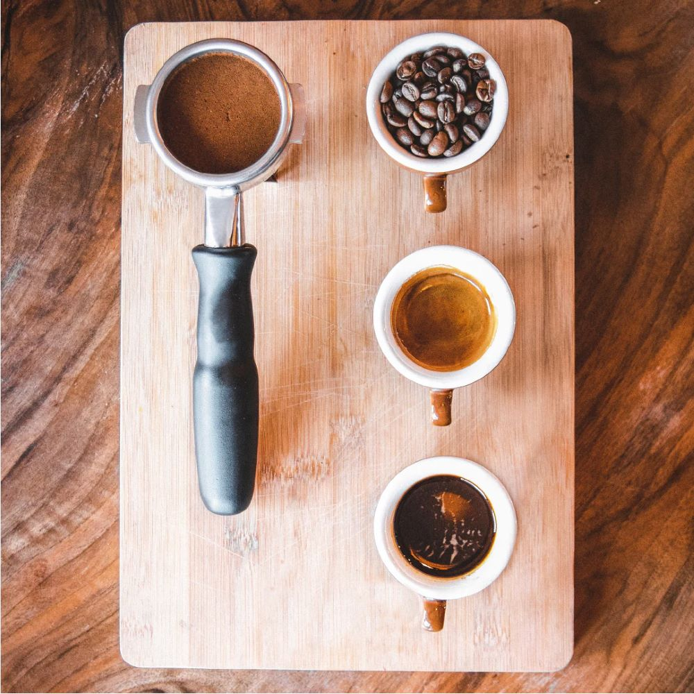
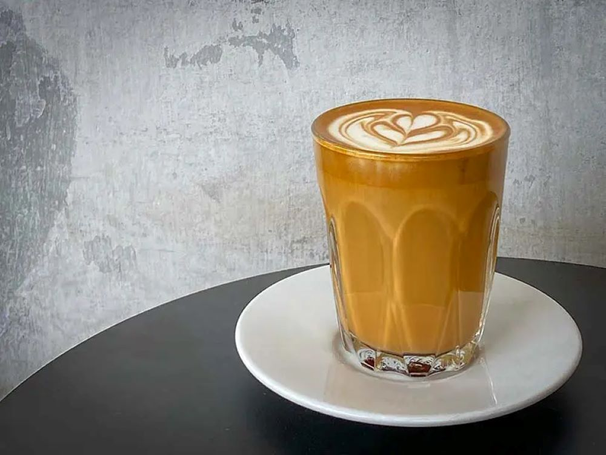
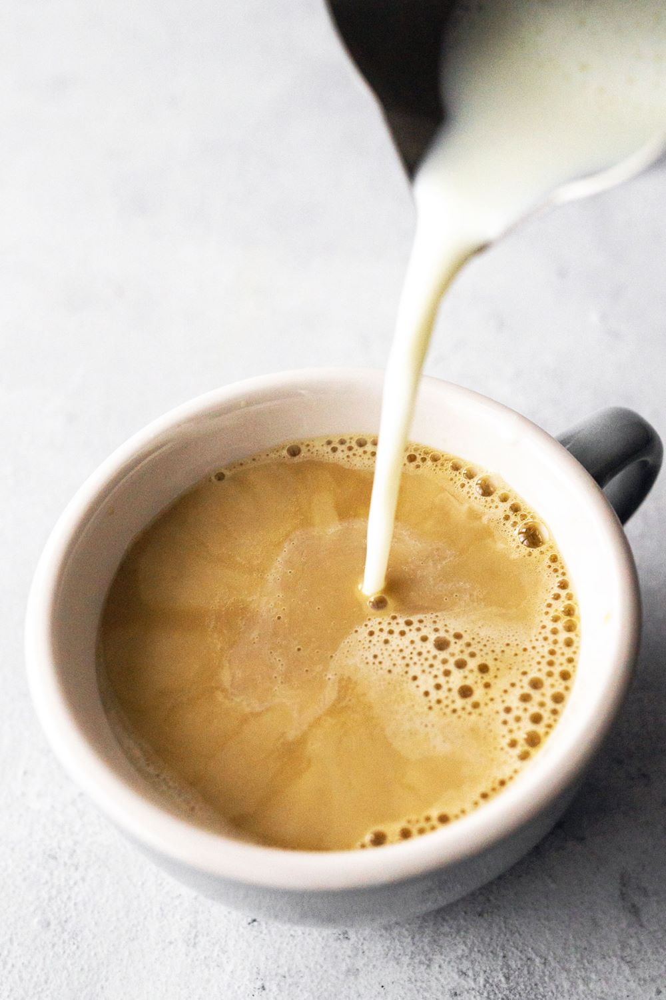
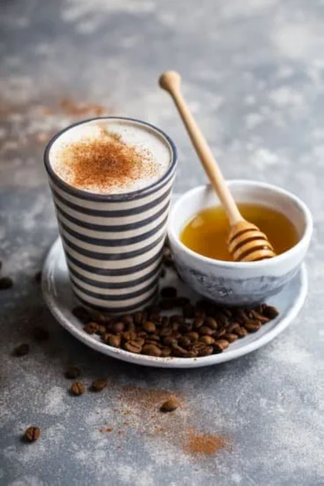

# Welcome!

## A one-stop shop for different types of coffee and my favorite barista blends.

### What is Espresso?
*Espresso* is a more concentrated form of coffee that originated in Italy. It is produced by forcing hot water under pressure through finely-ground coffee beans. It is thicker and more intense than regular coffee.

### The History of Coffee

Some historians and researchers believe that coffee beans were first eaten in Ethiopia and there is a famous legend that surrounds Kaldi, an Ethiopian goat herder, who is rumored to have first discovered it circa 800 AD. 

### Etymology
The word coffee entered the English vocabulary in 1582 from the Duth word *koffie*, which was borrowed from the Arabic *qahwah* meaning "the dark one". Etymologists have also connected it to the Kaffa region of Ethiopia.

### Where Does Coffee Come From?
Coffee is mostly grown along the "coffee belt" between the Cancer and Capricorn tropics. This includes Central and South America, Central Africa, India, and Southeast Asia. 

### The Best of the Classics

#### Breve
Made with espresso and steamed half-and-half, the breve makes for a rich and creamy drink. 

| Taste      | Texture | Add-ins |
| --- | --- | --- |
| bold, balanced | rich, creamy | cocoa powder |

#### Cafe au Lait
Brewed coffee and steamed milk make this a breakfast classic.

| Taste      | Texture | Add-ins |
| --- | --- | --- |
| bitter-sweet, mild | steamed, smooth | sweetener, vanilla |

#### Cafe con Miel
Espresso, milk, honey, and cinnammon. All of the best sweets and spices for this perfect cup of coffee.

| Taste | Texture | Add-ins |
| --- | --- | --- |
| strong, sweet | foamy, creamy | sweetener |

### What You'll Need

[French Press](https://www.amazon.com/YMMIND-Stainless-Resistant-Thickness-Borosilicate/dp/B0CBN8FXDP/ref=sr_1_4_sspa?crid=2VEW5HILMA6N5&dib=eyJ2IjoiMSJ9.6Yg23UbUifTQa27JlHZmJ-0ffFegsig_-tnsNflWFZaVYbm0qTgoGSYicgnc4757aBHKNFFKhWBW34MBLssumgyxVuZ9kh6PwgiaBGzXBd0Fabwm0xiuEOu6VXTYtinvLogNQPYA82zRKBapp9jydAW7VLNbiGYERW5m3EQqcjsnrtPPbk6qfDHYA_56Nhjjjj3D2rTJP3hhu8QW3i18zDiwBj4E9mHkOQJyyO4rVj5Qm-N4SDv-ZeI5gSpcbCG0wL2VEfJ0l-ePWDPkP5p0_Hp8p6zeRlnTjWGU2zVbHF8.GZBKijH2bfffUhQmh9mX_7MVrPR9BIgzgRsLCtRi0Ac&dib_tag=se&keywords=french+press&qid=1727798855&sprefix=french+pres%2Caps%2C148&sr=8-4-spons&sp_csd=d2lkZ2V0TmFtZT1zcF9hdGY&psc=1)

[Milk Frother](https://www.amazon.com/Maestri-House-Rechargeable-Waterproof-Detachable/dp/B0CKP3CYFB/ref=sr_1_10?crid=308VWGPRWE81Q&dib=eyJ2IjoiMSJ9.8-biD50_qzGh_KohZmYHosJboXxShq5s51rwDhJnkQpvppRSxI_lBpwQ3U4t1IX98dYCfTVdhc9TaEoTahZETA237ZNrYLpy3kwYUJMpFHTO6cFhAlzdyLn7TQy2X8zWULriCMbdc8uMkFBHBPzZAYglSDF0aJ5sFsjCLH5jMAltqGFM6B841mG23LFLcMbJRBN2SaKMrbK5lS74BlcCJZxB8GNoFI9sjy7ec5bIgOeSPz4fvJ7iSbavLRuN4q3H_3bDHAnUq-TTcvtAJpcZmwwNEN6pINHa5J6Q0QEaguI._68tf1uhf_j5Vdyt8-tnkI2K8zlzg1b-B_ZouWXxBrc&dib_tag=se&keywords=milk%2Bfrother&qid=1727798887&sprefix=milk%2Bfrother%2Caps%2C138&sr=8-10&th=1)

[Coffee Mug](https://www.amazon.com/LINVIA-Ceramic-Novelty-Cappuccino-Espresso/dp/B0CD7SPSJV/ref=sr_1_3_sspa?crid=2VK2UIVVMY63E&dib=eyJ2IjoiMSJ9.WJxqXP2Ts-abeaZhrNAUiKDNv2JoRTJxrL6UpfVZpgcDWO4j47z4fi5neGL67UCpnAhwv_80PedGVmKUpSgWmYvIteFgZ1ECc59qaLKIozfU2A7ctCyGNGvEaZ0Dhuc3okB_eQkwkb7rXAp4mKSkdQlOcXvmo_DXXrsfAfqUxfyp8N08VD9tNwt7XIC-E6CFCVOvYmk6ywxddK1IOgHp67p6bkSJMrP_N-O90HTYBet0zWpzYCYQJvS0CEdyMTVVjs3p2QXB-77G6DkbV8FJ2prIUGjXrknuiw00TWGBQIw.uWeVDtS8VSuXkGDA931nSx3WsIQClHgVT8f-KTlbDg8&dib_tag=se&keywords=aesthetic%2Bcoffee%2Bmug&qid=1727798913&sprefix=aesthetic%2Bcoffee%2Bmug%2Caps%2C152&sr=8-3-spons&sp_csd=d2lkZ2V0TmFtZT1zcF9hdGY&th=1)

### Why Drink Coffee?
Aside from coffee's ability to provide increased alertness and higher energy, the caffeinated drink also has some great health benefits. 

* **Better Brain Function**
* **Lower Cancer Risk**
* **Reduced Risk of Heart Disease**
* **Can Help Prevent Parkinson's Disease**

___
> "Coffee, the favorite drink of the civilized world." - Thomas Jefferson